 

 

This repository contains curated resources and guidance to assist you during your Burp Suite Certified Practitioner (BSCP) exam and successfully passing the certification.

Resource: https://bscp-guide.vercel.app/

## Acknowledgements

This repository draws inspiration and resources from https://github.com/botesjuan/Burp-Suite-Certified-Practitioner-Exam-Study.
Special thanks to Juan Botes for creating a comprehensive study guide that served as a foundation for this project.

## 🧰 Hacking Notes Ecosystem

🌐 &nbsp;**[hacking-notes.com](https://hacking-notes.com)** &nbsp;·&nbsp; ✍️ &nbsp;**[blog](https://hacking-notes.medium.com/)** &nbsp;·&nbsp; 💬 &nbsp;**[discord](https://discord.gg/r68ameNHrD)**

| | Resource | What you get |
| :-: | -------- | ------------ |
| 🗺 | **[Hacker-Roadmap](https://github.com/Hacking-Notes/Hacker-Roadmap)** | Structured paths from beginner to pro — hobbyist, bug bounty, certs & degree. |
| 🔴 | **[RedTeam Notes](https://github.com/Hacking-Notes/RedTeam)** | Offensive security notes: recon, exploitation, Windows & Linux. |
| 🔷 | **[BlueTeam Notes](https://github.com/Hacking-Notes/BlueTeam)** | Defensive security notes: forensics, malware, log & packet analysis. |
| 🧩 | **[Extensions](https://github.com/Hacking-Notes/Extensions)** | Curated Chrome extensions for ethical hacking & recon. |
| 🔖 | **[Bookmarks](https://github.com/Hacking-Notes/Bookmarks)** | Curated hacker bookmark collection, one import away. |

<a href="#top">⬆ back to top</a>

